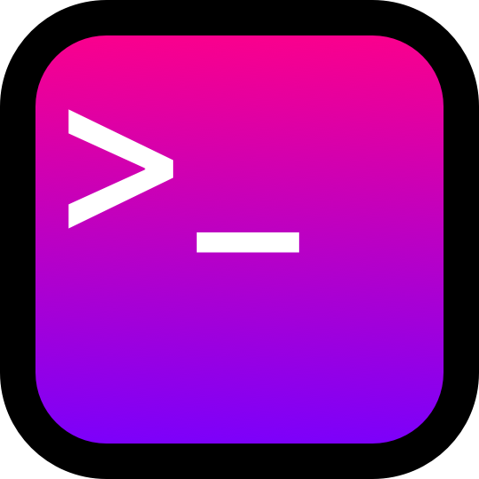

**Disclaimer: `@r-next-b/cli` was created to be used within react-next-boilerplate and is not intended to be used outside of react-next-boilerplate**

<p align="center">
  <a href="https://github.com/react-next-boilerplate/RNB-CLI">
    
  </a>
</p>

<br />

<div align="center">
  <!-- react-next-boilerplate STATUS -->
  <a href="https://www.npmjs.com/package/@r-next-b/cli">
    
  </a>
 
  <!-- VERSION STATUS -->
  <a href="https://www.npmjs.com/package/@r-next-b/cli">
    
  </a>
 
  <!-- LICENSE STATUS -->
  <a href="https://www.npmjs.com/package/@r-next-b/cli">
    
  </a>

</div>

<div align="center">💻 Simple commands to manage and facilitate specific react-next-boilerplate tasks</div>

## Commands

After installing it, `run rnb --help` without arguments to see list of options.

```shell
rnb
```

Starts a list of questions to choose tasks you need to do individually

```shell
rnb --c
```

Deletes the example app, replacing it with the smallest amount of boilerplate code necessary to start writing your app!

> Note: This command is self-destructive, once you've run it you cannot run it again. This is for your own safety, so you can't delete portions of your project irreversibly by accident.

```shell
rnb --g
```

Initializes a new project with this boilerplate. Deletes the react-next-boilerplate git history, installs the dependencies and initializes a new repository.

> Note: soon

<br />

Built using:

- [inquirer](https://github.com/SBoudrias/Inquirer.js/)
- [minimist](https://github.com/substack/minimist)
- [shelljs](https://github.com/shelljs/shelljs)
- [signale](https://github.com/klaussinani/signale)

## License

This project is licensed under the MIT license, Copyright (c) 2019 React Next Boilerplate. For more information see [project license](./LICENSE).

## Authors

- Jorge Luis Calleja Alvarado ([@wootsbot](https://twitter.com/wootsbot)) – [React Next Boilerplate](https://www.reactnextboilerplate.com/)
